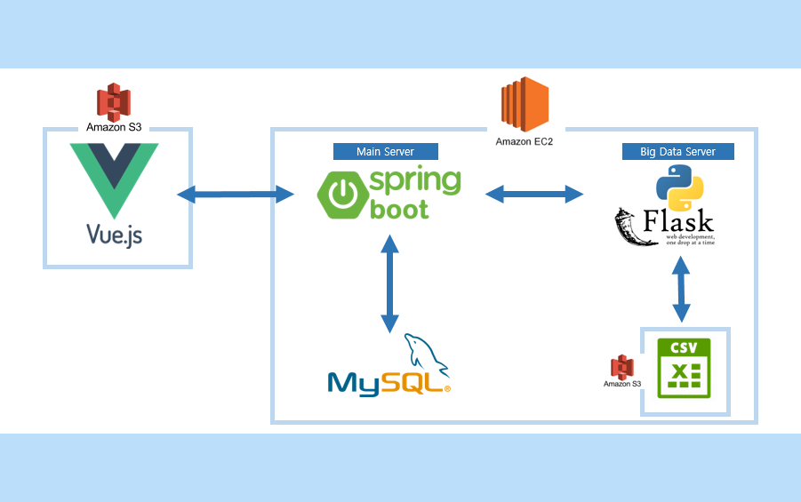

# README


### 프로젝트 소개

- 팀 명
  - Brain Flex
- 개발 계기
  - 나에게 필요한 알고리즘 문제를 쉽게 찾고 재밋게 풀자
- 개발 Point
  - 알고리즘 문제 추천, 동기 부여, 친구와 함께
- 기술 스택
  - BACKEND 
    - Spring
        : REST API방식으로 서버 구현
    - Flask
        : 빅데이터 추천 알고리즘으로 문제 추천
  - FRONTEND 
    - Vue : 반응형 웹 프레임 워크 구성
    - Vuetify : UI 컴포넌트 생성


### 실행방법

1. 배포 버전 (S3, EC2 with Docker)
	- http://brainflex.s3-website.ap-northeast-2.amazonaws.com/
	- http://j3c105.p.ssafy.io/api/brainflex/swagger-ui.html

	* swagger를 활용하여 기능 테스트 가능  
	* 현재 vue의 axios 부분 설정에 문제가 있어 배포 버전으로 테스트 불가

2. local vue + 배포 API 서버 버전
```
# front 폴더의 vue.config.js에서 var isLocal = false로 설정

cd ./front
npm install
npm install --save apexcharts
npm install --save vue-apexcharts
npm run serve
```
	- http://localhost:3000
	- http://j3c105.p.ssafy.io/api/brainflex/swagger-ui.html

	* 발표에 사용할 버전 

3. only local 버전
```
# front 폴더의 vue.config.js에서 var isLocal = true로 설정
# front 폴더의 vue.config.js에서 const LocalURL = 'http://localhost'로 변경 (nginx reverse proxy로 인해 80포트로 통신)

# run front 
cd ./front
npm install
npm install --save apexcharts
npm install --save vue-apexcharts
npm run serve

# build docker file
cd ./back/flask_test
# 도커 <이미지명>:<태그> 예시 qdae123/flask_test:sub3
docker build -t <도커이미지명>:<태그> .

cd ./back/Sub2_Spring_Server
docker build -t <도커이미지명>:<태그> .

# docker compose
# back 폴더의 docker-compose.yml 의 도커 이미지를 변경합니다 
# flask: 과 spring:의 image를 각각 위에서 생성한 이미지로 변경합니다.

# run docker container
docker-compose up
```

	- http://localhost:3000
	- http://localhost/api/brainflex/swagger-ui.html

	* 각자의 로컬 환경에서 프로젝트를 실행시키고 싶으시다면 위 방법을 사용합니다.

### 프로젝트 구조도




